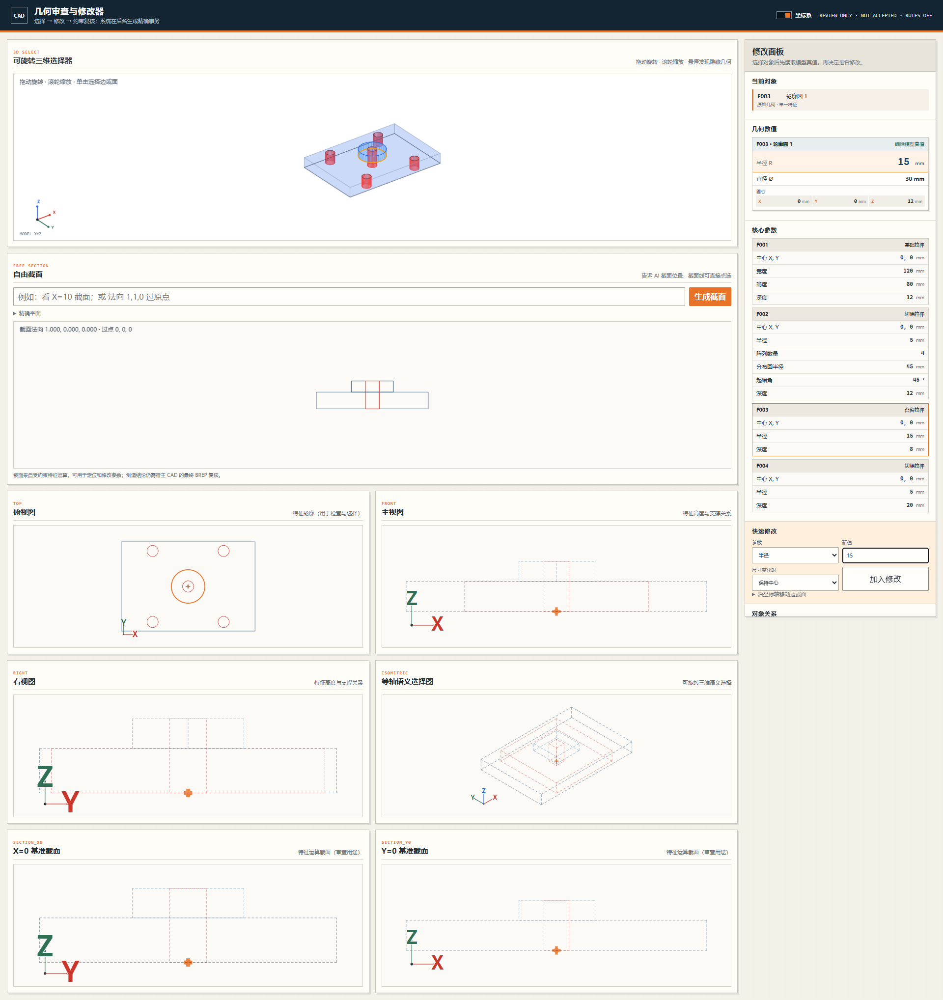
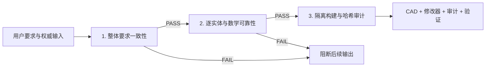

# aicad-agent 1.11.0

一个面向 Agent 的确定性 CAD 约束、审查与修改插件。你可以直接用自然语言告诉 Codex 要画什么、参考什么、哪些尺寸必须准确；插件负责把要求转换为逐实体计划、数学约束、CAD 文件、交互修改器和可审计验证结果。

**默认不需要 API Key。** 当前 Codex Agent 负责理解任务，本地插件负责约束验证、编译、审查和宿主适配。



> 当前定位是工程候选与人工审核工具。所有交付继续保持 `reviewOnly=true`、`accepted=false`、`ruleEnabled=false`、`packagingGated=true`。通过插件门禁不等于材料试验、刀模公差、量产可制造性或负责工程师技术验收。

## 自动打开审查界面

`generate`、`compile`、`build3d` 和 `multiview` 会生成绑定当前源哈希的审查 HTML 和打开记录；CLI/Agent 默认 `review_launch=never`，不会反复新建浏览器标签。显式使用 `auto` 时，HTML 会先复制到持久内容寻址目录并在 300 秒窗口内对相同内容去重；只有 `always` 才强制再次打开。临时源文件删除后，已打开页面仍有效；打开界面不等于接受设计。

## 30 秒了解它能做什么

| 能力 | 用户看到的结果 | 插件内部保证 |
|---|---|---|
| 自然语言画 2D CAD | DXF、SCR、AICAD、审计和清单 | 每条线都有 ID、用途、推理、依赖和数学约束 |
| 建筑平面专业制图 | 剖切粗实线、投影中实线、隐藏虚线、数学绑定轴网、原生尺寸 | 自动校验轴线坐标/覆盖、两端轴圈相切、轴号同值居中、房间用途来源、逐房间设备、全占用体净空、语义线宽线型、DIMSTYLE 与修改器显示一致性 |
| 规范报告质量 | 完整现象/根因/修正/预防规则记录、稳定唯一规则 ID | 相同记录折叠、冲突 ID 失败、同输入重复运行哈希一致 |
| 包装刀版设计与复核 | 切割/压痕/开槽/胶区分层图、白底预览、对象编号 | 先核对整体结构，再检查轮廓、闭合、槽口、胶区、公式和参数域 |
| 点击修改 2D/3D | 点线看长度和端点，点点看 XYZ，点圆看半径/直径/圆心 | 数值来自编译模型，不来自屏幕像素 |
| 多对象关系修改 | 选择两条线后直接提供平行、垂直、共线、等长等选项 | 修改绑定源对象、保留策略和依赖重放 |
| 坐标系与多视图 | 一个开关同步隐藏/显示二维轴、原点和三维轴 | 统一使用右手 `MODEL_XYZ`，单位为 mm |
| 网页/图片/PDF 参考重建 | 可编辑的 1:1 CAD、标注、文字和预览 | 图片只提供外观/拓扑；尺寸必须来自权威数据或校准关系 |
| AutoCAD 适配 | SCR/DXF、bundle、AICAD XData；有宿主时可生成 DWG | DWG、XData 和保存重开必须由真实 AutoCAD 门禁证明 |
| SolidWorks 3D | 受控拉伸、切除、孔阵列、SLDPRT/STEP | 事务式执行、重建回读、可选原生持久拓扑验证 |
| 错误学习闭环 | 报告“现象—根因—修复—新增规则” | 每个新错误必须加入永久规则和可重复回归测试 |

## 为什么不是“直接让 AI 发 CAD 命令”

直接拼接 CAD 命令很容易出现三类低级错误：中文进入命令流导致乱码；局部线段看似正确但整体产品结构错误；同类错误每次依赖人工重新发现。

`aicad-agent` 使用不可跳过的三级门禁：



整体门禁要求每条硬需求满足 `boundActual = observed = expected`；几何门禁计算独立约束秩并检查拓扑、功能面和参数域；构建门禁在隔离目录核对文件身份、ASCII 执行通道和 SHA-256。复制一个“正确数字”到报告里不能绕过验证。

## 安装步骤

### 方式 A：从 GitHub marketplace 安装（推荐）

准备：Codex CLI 或 Codex 桌面版、Git、Python 3.10+。

```powershell
codex plugin marketplace add JMET04/aicad-agent --ref v1.11.0
codex plugin add aicad-agent@aicad-agent
codex plugin list
```

看到 `aicad-agent` 为 `installed, enabled` 后，**新建一个 Codex 任务**。插件技能和 MCP 工具会在新任务的干净上下文中加载。

更新：

```powershell
codex plugin marketplace upgrade aicad-agent
codex plugin add aicad-agent@aicad-agent
```

卸载：

```powershell
codex plugin remove aicad-agent
```

### 方式 B：下载压缩包

从 [GitHub Releases](https://github.com/JMET04/aicad-agent/releases) 或仓库的 [`dist`](dist/) 目录下载：

- `aicad-agent-1.11.0.zip`
- `SHA256SUMS`

先核对哈希：

```powershell
Get-FileHash .\aicad-agent-1.11.0.zip -Algorithm SHA256
Get-Content .\SHA256SUMS
```

解压后顶层目录为 `aicad-agent`，其中包含插件清单、技能、MCP、规则、Schema、脚本、测试、AutoCAD bundle 源和 SolidWorks 宿主源。

## 第一次使用：完全不需要写代码

### 第 1 步：把目标和权威尺寸说清楚

在新 Codex 任务中直接输入，例如：

> 使用 aicad-agent 画一个 120×80×12 mm 的安装板，中心开直径 30 mm 的通孔。第一条生产线从原点开始，每个实体写明用途、依赖和数学约束。先核对整体要求，再输出 DXF、AICAD、审计、验证和多视图修改器。

如果有参考图纸、网页截图、PDF、DXF 或产品数据，直接附上并说明优先级。推荐写法：

> 尺寸以 design.json 为最高优先级，DXF 用于几何对象对应，图片只用于外观和标注布局，不允许从像素猜尺寸。

### 第 2 步：让 Agent 先做整体核验

插件应先确认：

1. 产品类型和用途是否匹配；
2. 结构族、标准、上部/下部闭合是否匹配；
3. 关键尺寸由哪个输入提供权威；
4. 必需、允许和禁止的功能；
5. 需要输出哪些 CAD、预览、审计和验证文件；
6. 是否存在输入冲突或未经确认的高影响假设。

整体要求没有证明一致时，不应先画一堆线再返工。

### 第 3 步：查看生成结果

基础 2D 编译通常会得到：

- `*.plan.json`：规范化意图计划；
- `*.aicad`：ASCII 约束执行记录；
- `*.scr`：AutoCAD 脚本；
- `*.dxf`：便携二维几何；
- `*.audit.md`：中文逐实体用途、关系、根因和审计；
- `*.manifest.json`：版本、实体统计、源计划身份和文件哈希。

包装或参考重建任务还可生成白底 PNG、原生中文 SVG、交互 HTML、对象目录、`validation.json` 和 `validation.md`。

### 第 4 步：用修改器审查和修改

对 Agent 说：

> 用 aicad-agent 打开这次结果的多视图修改器，我要逐项检查和修改。

在修改器中：

1. **点击直线**：右侧“几何数值”显示模型长度、起点 XYZ、终点 XYZ；可编辑长度会自动回填正确控制参数。
2. **点击点**：显示该点在 `MODEL_XYZ` 中的 X/Y/Z 坐标；参数化中心点可直接回填中心坐标。
3. **点击圆**：显示半径、直径和圆心 XYZ；点击半径可回填对应半径参数。
4. **点击面**：显示模型面积和几何中心；面仍作为审查对象，不冒充原生宿主 BREP 名称。
5. **坐标系开关**：顶部“坐标系”开关同步控制所有二维/截面视图的轴和原点，以及可旋转三维视图的 XYZ 三轴。
6. **多选关系**：连续选择两个兼容对象，直接选择平行、垂直、共线、等长、同心、重合等可用关系。
7. **文字修改**：也可以直接描述“让这两条线共线，孔径改成 18 mm，其他关键尺寸保持不变”。
8. **自由截面**：三维任务可使用轴向截面或 `法向量 + 经过点` 定义任意截面，并把截面曲线映射回语义参数。

修改器记录的是受控修改请求。Agent 会重新求解几何并重跑全部门禁，不会用一次点击绕过整体结构检查。

### 第 5 步：要求最终复核

推荐直接说：

> 对最终结果做整体核验：逐项比对用户要求、权威尺寸、对象目录、几何、图层、标注、文字编码、视觉重叠、宿主重开和文件哈希。发现错误时同时给出根因和需要新增的永久规则。

只有有真实 AutoCAD/SolidWorks 宿主证据的项目，才能报告对应宿主保存重开通过。

## 常用任务提示词

### 普通 2D

> 使用 aicad-agent 绘制一块 200×120 mm 的板，四角 R10，中心孔直径 24 mm。尺寸以我提供的数值为准；逐实体解释用途和约束，验证后输出 DXF、SCR、审计和修改器。

### 包装刀版

> 使用 aicad-agent 设计插舌上盖、自锁底的包装展开图。先确认整体结构族和上下闭合，不允许上下镜像猜测；检查每个摇盖、插舌、槽口、胶区、闭合公式和参数组合，通过后再输出分层 CAD 和白底中文审查图。

### 网页或图片参考图

> 使用 aicad-agent 按参考网页重建 1:1 CAD。尺寸以页面标注和我给的校准尺寸为准；图片像素不能作为尺寸真值。保持结构比例、文字、标注位置、旋转、线宽层级，并检查乱码和重叠。

### 受控 3D

> 使用 aicad-agent 建一个 120×80×12 mm 安装板，中心凸台直径 30 mm、高 8 mm，中心通孔直径 15 mm。先生成受控 3D 计划和多视图修改器；如果本机 SolidWorks 可用，再生成 SLDPRT/STEP 并保存重开验证。

## 主要功能详解

### 1. 2D 逐实体约束

支持 `LINE`、`CIRCLE`、`ARC`。每个实体必须包含稳定 ASCII ID、用途、推理、已生成依赖、数学约束、图层和生产语义。首实体锚定 `(0,0)`，禁止前向引用、零长度、非正半径和重复几何；必要时可使用不会进入生产输出的 `ORIGIN_BOOTSTRAP`。

### 2. 数学确定性与产品正常性

插件不是简单统计“写了多少条约束”，而是计算独立雅可比秩。等式满秩只证明几何唯一，不证明产品正确，所以还会检查单闭合轮廓、端点归属、结构面、功能面、工艺区、上下闭合、结构公式和参数组合。

### 3. 包装刀版规则

当前规则覆盖切割/压痕/开槽/胶区语义、端点连续、轮廓简单性、圆角切线、槽宽、摇盖对口、插舌完整面与锥度、胶区、闭合公式、外包框、上下闭合分型和耦合参数域。默认模板是已建模回归结构，不会把“常见结构”当成所有包装的默认真值。

### 4. 精确选择与关系修改

可见细线和点击命中区分离，既保持图纸精细，又让线段容易点中。对象使用稳定语义键跨视图同步；边号、角号、面号可保留；修改事务绑定源哈希、保留策略、共享阵列影响范围和完整依赖重放。

### 5. 模型测量与坐标系

每个可选线、点、圆、面都携带类型化 `measurement`。长度、端点、坐标、半径、直径、面积和中心来自约束求解后的模型。屏幕缩放、透视投影和命中像素没有尺寸权威。统一坐标系是右手 `MODEL_XYZ`，单位为 mm。

### 6. 1:1 参考重建

支持校准网页 SVG、SVG、光栅图和 PDF。矢量对象可按真实 DOM/object ID 映射；光栅图必须由权威尺寸或校准点建立比例。几何、尺寸、文字内容、标注位置/旋转、线宽、比例、乱码和重叠分别设门禁。

### 7. AutoCAD

无 AutoCAD 时仍可生成 AICAD、SCR、DXF、审计和清单。安装 AutoCAD 2025+ 后，可通过 bundle 执行、保存 DWG、写入 AICAD XData，并在保存重开后复核图层、坐标、中文和 XData。便携 DXF 不能冒充 DWG 宿主验证。

### 8. SolidWorks 3D

受控特征集包括基础拉伸、凸台拉伸、切除、中心矩形、圆和圆周阵列。无宿主时可以 `--no-execute` 生成计划与审计；有已授权 SolidWorks 2026 时可构建 SLDPRT/STEP、回读实体/体积/面积/包围框，并验证持久拓扑引用。未支持的特征会明确拒绝，不会静默近似。

### 9. 防乱码与审计

AICAD/SCR 执行通道保持 ASCII；中文用途、推理、根因和说明进入 UTF-8 审计及 CAD TEXT/MTEXT。每个候选文件写入 SHA-256，验证源计划身份和必需工件完整性。

### 10. 错误学习

发现错误后必须记录 `symptom`、`root cause`、`correction`、`prevention rule`、永久规则 ID 和可稳定重现旧错误的回归样例。这样错误会在后续任务中被自动阻断，而不是每次重新画很多遍。

## MCP 工具

插件公开 9 个本地 MCP 工具：

- 通用：`aicad_capabilities`；
- 2D：`aicad_get_plan_schema`、`aicad_generate`、`aicad_validate_plan`、`aicad_compile_plan`；
- 3D：`aicad_solidworks_doctor`、`aicad_get_3d_plan_schema`、`aicad_validate_3d_plan`、`aicad_build_solidworks_part`。

## 本地 CLI 使用

克隆仓库并查看能力：

```powershell
git clone https://github.com/JMET04/aicad-agent.git
cd aicad-agent
python agent-plugin/aicad-agent/scripts/aicad_agent.py capabilities
```

编译示例 2D 计划：

```powershell
python agent-plugin/aicad-agent/scripts/aicad_agent.py compile `
  --plan examples/rectangle.plan.json `
  --out build/rectangle `
  --name rectangle
```

生成 3D 计划但不调用 SolidWorks：

```powershell
python agent-plugin/aicad-agent/scripts/aicad_agent.py build3d `
  --plan examples/mounting_plate_3d.plan.json `
  --out build/mounting-plate `
  --name mounting_plate `
  --no-execute
```

包装任务的受控输出边界：

```powershell
python agent-plugin/aicad-agent/scripts/aicad_guarded_delivery.py `
  --contract requirement-contract.json `
  --trace requirement-trace.json `
  --plan drawing.plan.json `
  --geometry geometry.json `
  --template structure.normality.json `
  --instance drawing.instance.json `
  --out build/candidate `
  --report-dir build/reports `
  --name drawing
```

## 依赖与降级行为

| 环境 | 可用能力 | 明确不可声称 |
|---|---|---|
| Python 3.10+ 标准库 | 基础 2D 计划验证与编译 | 包装拓扑/预览依赖未安装时的完整 QA |
| 加装 `jsonschema`、`ezdxf`、`Pillow`、`Shapely` | 合同、DXF、预览、包装拓扑 QA | AutoCAD/SolidWorks 原生宿主结果 |
| AutoCAD 2025+ | DWG、XData、保存重开门禁 | 材料或量产验收 |
| SolidWorks 2026 + .NET Framework 4.8 | SLDPRT、STEP、原生拓扑重开 | 未建模特征族的正确性 |

安装可选包装依赖：

```powershell
python -m pip install -r agent-plugin/aicad-agent/requirements-packaging.txt
```

默认包不分发 SolidWorks 专有互操作 DLL。

## 开发与验证

```powershell
python -B -m unittest discover -s tests -p "test_*.py" -v
python -B -m unittest discover -s agent-plugin/aicad-agent/tests -p "test_*.py" -v
.\scripts\build-agent-plugin.ps1 -OutputDirectory release-ci -Version 1.11.0
python -B scripts/verify_release_package.py release-ci/aicad-agent
.\scripts\build-github-source.ps1 `
  -OutputDirectory release-ci/github-repository `
  -Version 1.11.0 `
  -PluginArchive release-ci/aicad-agent-1.11.0.zip `
  -PluginDirectory release-ci/aicad-agent
python -B scripts/verify_github_source.py release-ci/github-repository
```

当前 1.11.0 本地门禁覆盖自动打开审核、线/点/圆模型测量、坐标系同步隐藏/开启与重开持久化、建筑细节预编译阻断，以及安装后哈希不变门禁。CI 会在每次 push 和 pull request 中重新构建并验证发布源。

## 文档索引

- [详细功能说明](docs/FUNCTIONS.zh-CN.md)
- [安装和使用指南](docs/INSTALL.zh-CN.md)
- [选择测量与坐标系契约](docs/SELECTION_MEASUREMENT_UI_V3.md)
- [CAD 修改器交互契约](docs/MODIFIER_UI_V2.md)
- [精确子对象修改](docs/EXACT_SUBOBJECT_CORRECTION.md)
- [网页/图片参考重建](docs/WEB_REFERENCE_REBUILD.md)
- [SolidWorks 原生拓扑回读](docs/NATIVE_SOLIDWORKS_TOPOLOGY.md)
- [变更日志](CHANGELOG.md)
- [安全策略](SECURITY.md)
- [第三方依赖说明](THIRD_PARTY_NOTICES.md)

## 许可证

项目采用 [MIT License](LICENSE)。SolidWorks 专有互操作程序集不会随仓库或默认发布包分发。

- Architectural QA now treats complete axis groups and the stage-specific annotation matrix as mandatory, not as optional presentation polish.
