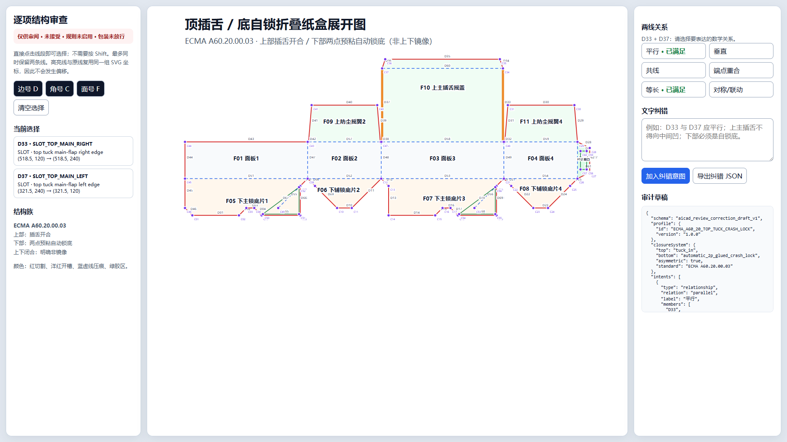
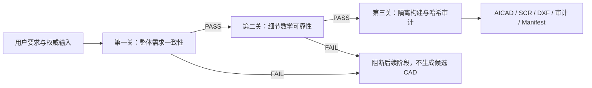

# aicad-agent 1.3.1

一个面向 Agent 的确定性 CAD 约束插件。它先证明生成目标与用户的整体要求一致，再证明逐线几何和产品结构可靠，最后才允许输出候选 CAD 文件。



> 当前定位：工程候选与人工审核工具。`reviewOnly=true`、`accepted=false`、`ruleEnabled=false`、`packagingGated=true`。通过验证不等于材料强度、刀模公差、量产可制造性或技术验收。

## 它解决什么问题

普通 AI 画 CAD 容易出现三类问题：

- 指令流混入中文或自由文本，导致 AutoCAD 命令乱码；
- 每条线看似正确，但组合后成为错误产品，例如主摇盖内凹、上下闭合被错误镜像；
- 先生成文件再靠人工反复找错，错误没有沉淀成下次自动阻断的规则。

`aicad-agent` 将这些风险改造成不可跳过的硬门禁：



第一关要求每条硬需求满足 `boundActual = observed = expected`。验证器会从当前结构模板、实际参数实例或需求契约中重新读取真实值，因此追踪文件不能靠复制一个“正确数字”自证通过。

## 主要能力

| 能力 | 说明 |
|---|---|
| Agent-first、默认无 API Key | 当前 Agent 编写计划，本地验证器和编译器执行；默认不调用模型供应商 API |
| 2D 逐实体约束 | 支持 `LINE`、`CIRCLE`、`ARC`；每个实体包含 ASCII ID、用途、推理、依赖和数学约束 |
| 原点与引用纪律 | 首实体锚定 `(0,0)`；禁止前向引用；必要时使用不进入生产输出的 `ORIGIN_BOOTSTRAP` |
| 整体需求强绑定 | 校验产品类型、结构族、标准、上下闭合、尺寸、主要功能、输入权威、冲突、输出和安全锁 |
| 独立约束秩 | 计算雅可比矩阵独立秩，不把重复约束数量误当成几何确定性 |
| 包装刀版正常性证明 | 校验端点归属、单闭合轮廓、面凸性、槽口、胶区、折叠公式、外包框和耦合参数域 |
| 类型化上下闭合 | 上部和下部闭合分别建模，禁止把“常见结构”或镜像猜测冒充用户要求 |
| 可交互修改器 | 直接点击边；连续选择两条边后显示平行、垂直、共线、端点重合、等长、对称/联动 |
| 边/角/面语义 | 审查界面保留边号、角号、面号，命中线与可见线共用同一坐标 |
| 防乱码输出 | AICAD/SCR 执行通道保持 ASCII；中文用途、推理和根因保存在 UTF-8 审计及 CAD 文字层 |
| AutoCAD 适配 | 生成 SCR/DXF，提供 AutoCAD bundle、AICAD XData 工作流和可选真实宿主保存重开验证 |
| SolidWorks 3D | 支持受限、事务式的拉伸/切除/孔阵列计划；失败即停；可选 SLDPRT/STEP 宿主 |
| 错误学习闭环 | 每个错误输出“现象—根因—修复—永久规则”，并要求增加可重现的红色回归测试 |
| 可复现交付 | 生成 manifest、逐文件 SHA-256、ASCII 检查、计划身份核对和原子化候选目录 |

更完整的逐项说明见 [详细功能说明](docs/FUNCTIONS.zh-CN.md)，安装与宿主配置见 [安装和使用指南](docs/INSTALL.zh-CN.md)。

## 数学保证模型

不存在适用于所有 CAD 的固定约束条数。设 `V` 为命名顶点数、`P` 为参数变量总数、`K` 为独立设计参数数，则总变量数 `N = 2V + P`。参数化结构族需要独立等式秩 `N-K`；具体尺寸实例需要独立等式秩 `N`，并且实例剩余自由度必须为 0。

等式满秩只证明“几何被唯一确定”，不能证明“产品选对了”。因此最终判定还必须同时满足整体需求、拓扑、功能面、闭合类型、工艺区、参数域和工件审计门禁。

当前默认插锁盒回归样例实测：

- 整体硬要求 12/12、受控实际值绑定 12/12；
- 结构族独立秩 132/132；
- 实例独立秩 144/144，剩余自由度 0；
- 70 条生产实体、60 个命名顶点、12 个结构面；
- 624 项估算原子硬检查、255 组参数域案例；
- 六种候选工件全部通过哈希审计。

## 从 GitHub 安装

推荐通过 Git marketplace 安装固定版本：

```powershell
codex plugin marketplace add JMET04/aicad-agent --ref v1.3.1
codex plugin add aicad-agent@aicad-agent
```

安装完成后新建一个 Codex 任务，使技能和 MCP 工具从干净上下文加载。普通 Agent 调用不需要 `OPENAI_API_KEY`。

也可以在 [Releases](https://github.com/JMET04/aicad-agent/releases) 下载 `aicad-agent-1.3.1.zip` 和 `SHA256SUMS`。

## 快速使用

在 Codex 中直接描述目标：

> 使用 aicad-agent 画一个 120×80 mm 的矩形板，中心开直径 20 mm 的孔。先验证整体要求和数学约束，通过后再输出 DXF。

本地 CLI：

```powershell
python agent-plugin/aicad-agent/scripts/aicad_agent.py capabilities
python agent-plugin/aicad-agent/scripts/aicad_agent.py compile --plan examples/rectangle.plan.json --out build/rectangle --name rectangle
```

包装任务使用受控输出边界：

```powershell
python agent-plugin/aicad-agent/scripts/aicad_guarded_delivery.py --contract requirement-contract.json --trace requirement-trace.json --plan drawing.plan.json --geometry geometry.json --template structure.normality.json --instance drawing.instance.json --out build/candidate --report-dir build/reports --name drawing
```

## MCP 工具

插件公开 9 个 MCP 工具：

- 通用：`aicad_capabilities`；
- 2D：`aicad_get_plan_schema`、`aicad_generate`、`aicad_validate_plan`、`aicad_compile_plan`；
- 3D：`aicad_solidworks_doctor`、`aicad_get_3d_plan_schema`、`aicad_validate_3d_plan`、`aicad_build_solidworks_part`。

## 输出文件

2D 编译会生成：

- `*.plan.json`：规范化意图计划；
- `*.aicad`：ASCII 约束执行记录；
- `*.scr`：AutoCAD 脚本；
- `*.dxf`：便携二维几何；
- `*.audit.md`：中文逐实体用途、关系、根因和审计；
- `*.manifest.json`：版本、实体统计、源计划身份和哈希。

包装正常性审查还可以生成白底 PNG、原生中文 SVG、交互 HTML、对象目录和验证报告。

## 环境与降级

- 核心：Python 3.10+，标准库即可运行基础 2D 编译；
- 包装 QA：可选 `ezdxf`、`Pillow`、`Shapely`；
- AutoCAD：可选 AutoCAD 2025+；没有宿主时仍可生成 AICAD/SCR/DXF，但不能声称真实 DWG 保存重开通过；
- SolidWorks：可选 Windows x64、.NET Framework 4.8 和已授权 SolidWorks 2026；没有宿主时只生成受控 3D 执行计划和审计。

## 验证

```powershell
python -B -m unittest discover -s tests -p "test_*.py" -v
python -B -m unittest discover -s agent-plugin/aicad-agent/tests -p "test_*.py" -v
./scripts/build-agent-plugin.ps1 -OutputDirectory release-ci -Version 1.3.1
python -B scripts/verify_release_package.py release-ci/aicad-agent
```

本版本发布前已实测根级 34 项、插件级 31 项以及安装集成级 56 项回归；GitHub CI 会在每次 push 和 pull request 上重新执行源码测试与发布包核验。

## 许可证

项目采用 MIT License。SolidWorks 专有互操作程序集不会随仓库或默认发布包分发，详见 [第三方依赖说明](agent-plugin/aicad-agent/THIRD_PARTY_NOTICES.md)。
