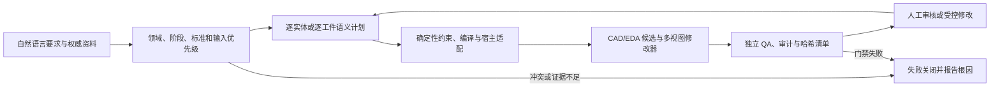

# aicad-agent 产品介绍

版本：1.13.0
形态：Codex 插件 + 本地 MCP + 确定性 CAD/EDA 工程流水线
许可证：MIT

## 一句话定位

`aicad-agent` 把自然语言工程要求、权威尺寸和参考资料，转换为可编辑的 CAD/EDA 候选、交互审查界面、逐项验证报告和哈希绑定的交付清单。它的重点不是“让 AI 多画几条线”，而是让生成、修改、复核和交付都具有明确约束、来源和审计证据。

默认工作流不需要额外的模型 API Key：Codex Agent 理解任务，本地插件负责 Schema、约束求解、编译、审查和宿主适配。

## 它解决什么问题

普通的 AI 绘图自动化往往只有最终图形，缺少三个关键答案：

1. 每个对象为什么存在，受哪些尺寸和关系控制；
2. 修改一个尺寸后，哪些对象必须一起重算，哪些关键条件必须保持不变；
3. 输出文件是否来自同一版本、是否完整、是否经过真实宿主或独立门禁验证。

`aicad-agent` 在生成之前先冻结领域、交付阶段、标准、权威输入和禁止假设；生成时把每个实体绑定到稳定 ID、用途、依赖和数学约束；生成后输出可点击修改器、中文审计、机器验证、文件清单和 SHA-256。无法证明的能力会明确降级或阻断，不用“看起来正确”替代工程证据。

## 适合谁

- 希望在 Codex 中用自然语言创建和修改 2D 工程图的设计人员；
- 需要把参考图片、网页、PDF 或旧图转成可编辑、可校准 CAD 的团队；
- 需要 AutoCAD 或 SolidWorks 受控执行、保存重开和审计证据的工程流程；
- 需要检查机械技术包或 PCB 交付包是否完整、同版、可追溯的审核人员；
- 希望把重复错误沉淀为规则候选和负向回归，但不允许 AI 自行修改生产规则的团队。

它不替代注册工程师签字、材料试验、真实 ERC/DRC、SPICE、工艺评审、加工验证或制造授权。

## 工作方式



## 六个核心模块

| 模块 | 作用 | 主要结果 |
|---|---|---|
| Agent 任务接口 | 理解用户要求并建立输入权威顺序 | 规范化任务、规则包和交付范围 |
| 2D/3D 语义内核 | 把对象变成带 ID、用途、依赖和约束的计划 | AICAD、DXF、SCR、3D feature graph |
| 交互修改器 | 点击线、点、圆、面查看模型数值并发起受控修改 | 多视图 HTML、测量、坐标系和修改事务 |
| CAD 宿主适配 | 在具备授权宿主时执行并回读原生结果 | AutoCAD DWG/XData、SolidWorks SLDPRT/STEP |
| 工程证据门禁 | 检查产品要求、几何、文件闭包和跨工件一致性 | validation.json、validation.md、audit、manifest |
| 受控经验闭环 | 把结构化失败转成禁用的规则候选和回归证据 | hash-bound lesson、negative regression |

## 支持范围

### 通用 2D 与建筑制图

支持 `LINE`、`CIRCLE`、`ARC`、原生尺寸、语义图层、线宽/线型、坐标与关系约束。建筑规则进一步检查轴网坐标与覆盖、轴圈相切、房间用途、设备、净空、标注矩阵和图纸集一致性。

### 包装刀版与参考重建

包装规则覆盖切割、压痕、槽口、插舌、胶区、闭合结构和公式。参考重建支持网页 SVG、矢量图、光栅图和 PDF；像素只提供外观或拓扑，尺寸必须来自标注、权威数据或校准关系。

### 受控机械 3D

支持受控拉伸、凸台、切除、孔和阵列等特征族，以及多视图和截面审查。存在 SolidWorks 2026 与授权条件时，可执行原生构建、保存、重开和拓扑回读；没有宿主时只报告计划和候选能力。

### 机械技术包与 PCB 证据合同

v1.13.0 增加非补偿式证据合同 v3。机械门禁要求制造件和装配体的原生 CAD、STEP、制造图、BOM、材料、分析、检验与修订关系形成精确闭包；PCB 门禁要求每块板独立拥有 KiCad 工程、原理图、PCB、BOM、CPL、装配/制造图、3D 板、Gerber、PTH/NPTH 钻孔和 CAM 清单，并核对铜层与钻孔类别。

这类门禁证明的是“候选所声明的文件与关系一致”，不会自行证明证据来源真实，也不会授予生产或投板权限。

## 典型交付物

根据任务类型，输出可能包括：

- `*.plan.json`：规范化意图和约束计划；
- `*.aicad`：ASCII 安全的约束执行记录；
- `*.scr`、`*.dxf`：AutoCAD 脚本与便携二维几何；
- `*.sldprt`、`*.step`：具备真实宿主证据时的机械原生与交换格式；
- KiCad、Gerber、钻孔、BOM、CPL 与 CAM 清单候选；
- `review.html`、PNG/SVG：交互与静态审查；
- `validation.json`、`validation.md`：机器和人工验证报告；
- `audit.md`、`manifest.json`、`SHA256SUMS`：根因、规则、版本和文件身份。

## 安全与诚实边界

所有公开展示保持以下默认安全锁：

```text
reviewOnly=true
accepted=false
ruleEnabled=false
packagingGated=true
```

`evidenceContractReady=true` 只表示声明的证据合同通过结构与闭包检查。它不等于 `technicalPackageReady`、`productionReleaseEligible`、`manufacturingAuthorized` 或 `fabricationAuthorized`。经验候选也不能自行改写权威规则、测试、插件元数据或已安装插件。

## 当前可验证状态

- 四领域公开展示：建筑平面、三层钢结构、复杂机械零件、四层工业控制器 PCB；
- 发布版本：v1.13.0；
- 安装方式：GitHub marketplace 或 Release ZIP；
- CI：每次 push 和 pull request 重建并复核根级测试、插件测试、发布包、GitHub 净化源码和打包插件；
- 本地运行：Python 3.10+；AutoCAD/SolidWorks 属于可选宿主能力。

## 从哪里开始

1. 查看[四领域工程展示](../showcase/README.md)，先判断输出风格和审查材料是否符合预期；
2. 阅读[安装和使用指南](INSTALL.zh-CN.md)，安装插件并新建 Codex 任务；
3. 阅读[详细功能说明](FUNCTIONS.zh-CN.md)，了解命令、输出和降级行为；
4. 查看[v1.13.0 发布说明](RELEASE_NOTES_v1.13.0.md)，了解机械、PCB 和持续学习门禁；
5. 任何制造或投板决定都应继续经过对应专业人员、原生工具和组织审批流程。
