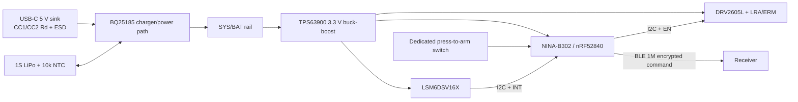
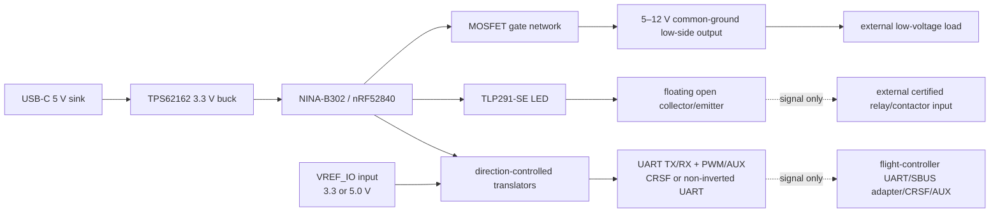

# System Architecture

Status: EVT review-only.

## Wand

The IMU supplies only short-window angular rate/acceleration features and a relative attitude estimate used for gesture classification. Bias, drift and magnetic-reference absence make precise absolute 3D position or trajectory claims out of scope.

## Receiver

## Trust and safety boundaries

- Pairing uses BLE 1M PHY and LE Secure Connections with an out-of-band, per-device unique provisioning secret. No default or fleet-wide production key is allowed.
- Each application command is additionally protected by AES-CCM with a nonce derived from device ID, session ID and monotonically increasing sequence number. Receiver persistent state prevents sequence rollback after reboot.
- Authentication alone never asserts an output. The wand's dedicated physical arm input, receiver allow-list, bounded arm lease and command validity window must all be true.
- On boot, reset, watchdog, BLE loss, authentication failure, stale/replayed sequence, supply fault or firmware fault, receiver outputs default inactive/high-impedance.
- Isolated open collector and common-ground MOSFET are different interfaces. The former transfers a low-rate dry transistor signal; the latter switches a low-voltage load and has no galvanic isolation.
- Mains conductors, certified relay contacts, ESC battery paths, motors and propulsion energy are outside the PCB and enclosure boundary.

## Timing budgets (design choices pending HIL validation)

| Function | Budget |
|---|---:|
| arm-switch debounce | 30 ms |
| deliberate arm hold | 800 ms |
| receiver physical-arm lease | 100 ms, refreshed at ≤25 ms only while the physical input remains asserted |
| gesture feature window | 160 ms with 50% overlap |
| command freshness at receiver | 150 ms |
| BLE/link-loss safe state | ≤250 ms |
| maximum single output pulse without fresh command | 500 ms |
| replay acceptance | strictly increasing sequence within active session; never accept duplicate |
