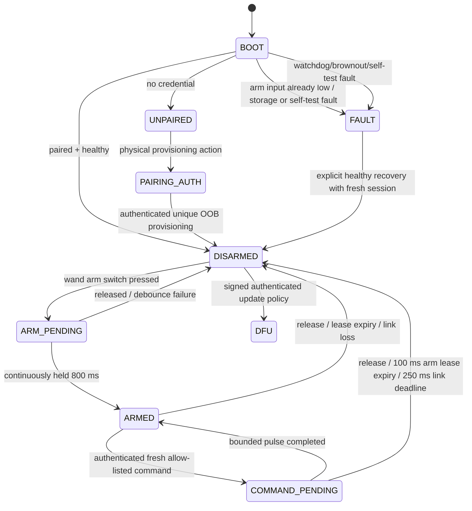

# Firmware State Machine and Safety Timing

Status: EVT review-only. Durations are design targets requiring target/HIL measurement.

## Output invariants

- Receiver UART/PWM/AUX, optocoupler LED and MOSFET gate initialize inactive before other peripherals and remain inactive in BOOT, UNPAIRED, PAIRING_AUTH, DISARMED, FAULT and DFU.
- Watchdog, reset, brownout, authentication/replay failure, session/storage uncertainty, BLE disconnect, 100 ms physical-arm lease expiry or 250 ms link deadline clears every output.
- Only `ARM_LEASE` refreshes physical authorization. Heartbeat and output commands do not. The paired wand sends a fresh lease at ≤25 ms only while the debounced dedicated arm input remains held.
- Switch release locally disarms the wand and schedules three authenticated DISARM frames immediately. Even if all are lost, the receiver lease expires within the SYS-002 100 ms target. This timing must be captured on real hardware; it is not proven by host tests.
- Each isolated/MOSFET pulse is capped at 500 ms and cannot survive arm-lease expiry. Only one of AUX, isolated OC or low-side output is active in this skeleton.
- Re-entry after link loss/reset requires a fresh authenticated session and renewed physical arm hold; stale output state is never restored.

## Feedback dictionary

Provisional haptic/indicator semantics to validate in a blinded user study:

| State/result | Haptic intent | Output side effect |
|---|---|---|
| paired | two short low-amplitude ticks | none |
| armed after 800 ms | one rising confirmation pattern | none until a separate valid gesture command |
| command accepted | one crisp short tick | command-specific bounded low-voltage output |
| gesture rejected / low confidence | one soft short tick | none |
| fault/disconnected/replay/auth failure | three spaced low-amplitude ticks if power permits | outputs forced inactive |

Motion alone is never the only feedback. Fault feedback must not share a waveform easily confused with accepted command feedback and must never activate an external output.

## Watchdog and scheduling requirements

- Hardware watchdog independently covers BLE, crypto, gesture and output tasks; no task may pet it on behalf of a stalled output manager.
- Highest-priority output-safe path processes arm release, lease expiry and reset notification. Heavy gesture/flash work is chunked or scheduled below it.
- Use monotonic wrap-safe deadline comparison. Measure worst-case scheduling latency under BLE TX, IMU interrupt, flash journal and haptic activity.
- Record the actual switch-release-to-receiver-inactive distribution and maximum under normal, congestion, retransmission, packet loss, reset and brownout cases.
