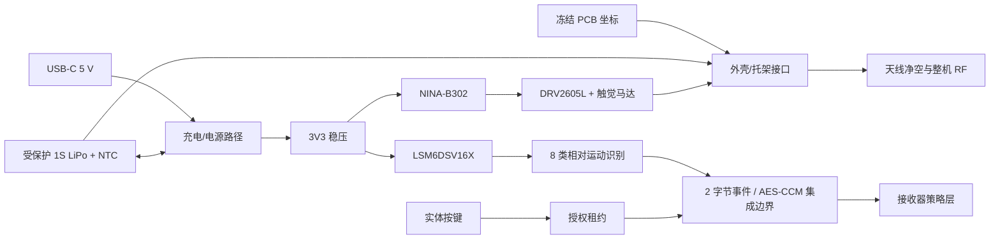

# 魔法杖系统工程交接与插件升级经验

日期：2026-08-22

当前配置：`WAND_PRINTABLE_REV_A0_PLUS_BARE_PCB_REV_A0`

机器可读状态：`CURRENT_SYSTEM_STATUS.json`

## 1. 当前结论

这次已经不再是“画一张图”，而是形成了相互绑定的电子、结构、固件和制造原型链：

- 魔法杖 15 × 80 mm、4 层 PCB 已冻结，原生 KiCad ERC 0、DRC 0、未连接 0、封装错误 0，23/23 封装权威测试通过；
- 嘉立创裸板 ZIP 已生成并校验，可按预设参数建立 **5 片原型裸板**订单；BOM/CPL 随包提供，但元件商城料号尚未闭环，所以本次不能冒充 PCBA 一键贴装包；
- 可打印外壳包含上下壳、PCB/电池托架、尾盖、8 mm 杖杆接头和按键柱，提供 STL、STEP、装配 STEP、预览和校验报告；6/6 STL 已通过单体、水密、有效体积、非流形边、破面、退化面和重复面门禁；
- 外壳已经预留受保护 1S LiPo 最大 11 × 6 × 42 mm、电池拉带/线束空间，以及 10 × 3.4 mm 硬币式触觉马达固定杯；电池、触觉马达、PCB、载架与壳体的受检碰撞体积均为 0；
- 便携式固件核心能区分轻敲、顺/逆旋、左/右挥、前刺、顺/逆时针画圈共 8 类动作，并具有实体按键门控、回稳拒识、跨轴含混拒识和 250 ms 防连击；2/2 主机测试通过；
- 手势结果形成两字节载荷并接入 AES-CCM 协议边界；当前主机测试使用非加密回调，不证明目标端加密、BLE 安全或防重放。接收器输出状态机仍明确不直接执行该事件，避免识别层绕过安全策略。

原型裸板和原型打印已经得到所有者授权；量产、PCBA、目标固件发布和整机性能声明仍未放行。

## 2. 三条必须同时闭环的系统流

任何一条流单独“看起来完成”都不能证明整机完成：

- 电源流决定电池尺寸、热、USB 开口、NTC、线束和欠压行为；
- 信息/安全流决定采样、识别、物理授权、加密、重放保护和接收器安全输出；
- 几何/RF 流决定 PCB 坐标、开口、按键、安装孔、电池/马达金属包络和天线净空。

## 3. 关键接口控制

| 接口 | 提供方 → 使用方 | 冻结契约 | 当前证据 |
|---|---|---|---|
| PCB→外壳 | 电子 → 机械 | `case_x = pcb_x - 7.5`；`case_z = pcb_y + 9.0` | `printable-wand/design-input.json` |
| 安装孔 | PCB H1/H2 → 托架 | `(0,29.25)`、`(0,86.0)`；尼龙 M2 | STEP/STL 与碰撞报告 |
| USB-C | J1 → 壳体 | `+X` 面，中心 `z=47.0 mm` | 上下壳圆角开口 |
| 实体按键 | SW1 → 壳体/固件 | `+Y` 面，中心 `z=73.5 mm`；松开即清空手势窗口 | 按键柱 + 流式测试 |
| 电池 | 电芯/线束 → 托架/J2 | 最大 11×6×42 mm；中心 `(0,-6.9,62)`，`z=41..83 mm`；BAT+/NTC/GND；8 mm 弯线余量 | 电源仓校验报告 |
| 触觉 | J3/DRV2605L → 上壳 | 最大直径 10×厚 3.4 mm；距 RF 区 5 mm | 固定杯 + 零碰撞报告 |
| 天线 | NINA → PCB/外壳 | 壳体 `z=5..30 mm` 内无电池、金属紧固件、致密填料 | PCB 约束 + 外壳包络 |
| 杖杆 | 结构 → 整机 | 8 mm GFRP，切长 195 mm，插到底后目标总长 315 mm | 打印装配指南 |
| IMU 坐标 | PCB/装配 → 固件 | 杖 `+X` 指尖、`+Y` 向左、`+Z` 向按键；原始轴必须校准映射 | `TARGET_GESTURE_INTEGRATION.md` |
| 手势事件 | 识别 → 无线/接收器 | `[gesture_id, confidence]`，置信度 70–100，精确 2 字节 | 2/2 主机管线测试；目标加密/HIL 未验证 |

接口文件必须比某一学科的图纸更有权威性。上游 PCB 坐标或电池包络变化后，机械包必须因哈希/约束不匹配而失败，不能静默沿用旧 STEP。

## 4. 原型制造与装配交接

### 嘉立创裸板

- 上传：`electronics/manufacturing/jlcpcb-wand-rev-a0/JLCPCB_WAND_REV_A0_GERBER_DRILL.zip`；
- 数量 5，4 层，板厚 1.6 mm，外层 1 oz，黑油白字，沉金，过孔盖油，单板；
- 不勾选阻抗、金手指、半孔、包边和拼板；去除订单号；
- 本次只下裸板。BOM/CPL 没有完整 LCSC/C-number 和替代料批准，不能勾选 SMT 贴装后假装“直接可用”。

### 外壳打印

- 使用 `mechanical/printable-wand/outputs/MW_PRINTABLE_WAND_REV_A0.zip`；
- 上下壳分型面朝打印平台，0.20 mm 层高、4 道壁、35% 陀螺填充；PETG/ASA/ABS/PA12；
- 首件先打印并干装，不上胶；测量实际收缩、USB 插拔、按键回弹、M2 扭矩、电池拉带和触觉马达夹持；
- 杖杆优先 8 mm 实心 GFRP，195 mm；未重新做 RF/结构审查前不要改成导电碳纤维或金属杆。

### 首次上电

先用电池模拟器和限流 USB，后接真实锂电。必须核对 J2 极性和 NTC；测试充电暂停、温升、3V3、I²C、IMU 轴、触觉马达、实体按键、掉电/复位和无线丢链。未做这些测试前，“零 ERC/DRC”只证明设计文件一致性，不证明实物安全或功能。

## 5. 尚未完成的工作（按风险排序）

1. 选定可采购的受保护 1S LiPo + 10k NTC + JST-SH 三线成品，核对供应商图纸、极性和真实最大尺寸；
2. 给所有 BOM 行完成供应商/LCSC 编码、生命周期、替代料和贴装方向复核，之后才能生成 PCBA 订单；
3. 先用真实切片器导入 6 个 STL，记录零修复/零悬浮岛和成功层预览，再打印首壳并装入真实 PCB、电池和触觉马达，记录尺寸修正；
4. 装配首板，执行 USB/充电/热/NTC/欠压/I²C/触觉/RF 上电测试；
5. 安装固定版本的 nRF Connect SDK/Zephyr/ARM 工具链，建立 NINA-B302 板级定义并生成、刷写、哈希化目标镜像；
6. 采集至少 12 名代表用户的数据，按用户划分训练/测试，报告混淆矩阵、误触发/小时、拒识率和延迟；
7. 完成接收器的冻结 PCB、制造包、目标固件和与魔法杖的 HIL 安全时序；
8. 完成独立电子、机械、无线和安全审查后再考虑生产放行。

## 6. 这次系统工程的核心经验

### 6.1 先冻结系统边界，再画图

“魔法杖”不是一个 PCB 或一个外壳，而是能源、传感、算法、无线、执行、人体和制造边界的组合。先定义用途、禁用场景、能量边界和可验证指标，再允许各学科生成图纸。否则每张图都可能局部正确、系统错误。

### 6.2 接口是跨学科的单一真相源

USB 中心、安装孔、电池包络、天线区、按键轴、坐标变换和协议载荷应进入机器可读 ICD。图纸、STEP、固件常量和制造包都从 ICD 派生，并绑定上游哈希。手工在多份文件里重复数字，必然产生本次旧 27 mm 壳体/新 PCB 坐标之类的漂移。

### 6.3 “生成”“工具验证”“实物验证”“生产放行”必须分层

- 生成：文件存在、格式可打开；
- 工具验证：ERC/DRC、编译、碰撞、清单哈希通过；
- 实物验证：首件尺寸、温升、波形、RF、HIL 和用户数据通过；
- 放行：配置、证据、人员审批和供应链均冻结。

插件不能把第一层或第二层的绿色状态包装成第四层。

### 6.4 变更必须反向传播

电池变厚会影响壳体、人体握持、天线、重心、充电热和 BOM；PCB 按键移动会影响开孔、按键柱、手势坐标和人机反馈。系统生成器需要依赖图和影响分析，而不是只重画被点名的那张图。

### 6.5 拒识和故障路径也是功能

手势识别不能只测试 8 个正样本；静止、含混跨轴、松开按键、防连击、丢链和低置信度才决定系统是否可用。每个功能都要同时定义成功路径、拒绝路径、超时路径和恢复路径。

### 6.6 工厂适配器必须消费已验证设计

嘉立创导出不能是人工复制设置。适配器应重新跑 ERC/DRC、校验板哈希、生成 Gerber/钻孔/BOM/CPL、写入订单参数并形成 manifest。若 BOM 供应链信息不完整，就只允许裸板模式，不能自动升级成 PCBA。

## 7. 将 AICAD 插件升级为系统设计器

建议把插件架构拆成八层：

1. **需求编译器**：把自然语言转成需求 ID、验收指标、禁止用途和验证方法；
2. **系统架构器**：建立能量流、信号流、力/热/物流和安全边界；
3. **接口契约引擎**：管理坐标、包络、连接器、单位、公差、协议和版本；
4. **学科生成器**：机械、电子、固件、包装、土木等各自生成原生可编辑文件；
5. **跨域求解器**：检查空间、热、功率、RF、线束、安装、维护和人机冲突；
6. **证据账本**：每个结论绑定源文件哈希、工具版本、测试命令、结果和声明边界；
7. **制造适配器**：针对嘉立创、3D 打印、机加工、包装打样或施工交付生成受控包；
8. **统一审查器**：按系统/接口/风险视角查看 2D、3D、PCB、协议、BOM 和开放门，而不是按文件夹浏览。

这个框架也适用于更广的工科图纸：

- 机械：力、运动、公差、材料、工艺和维护空间；
- 电子：电源、信号完整性、热、EMC、器件权威和制造测试；
- 包装：产品包络、缓冲、跌落、堆码、物流和标签法规；
- 土木：场地、荷载、结构、机电、排水、消防、施工阶段和规范证据。

不同学科共用的不是画线算法，而是“需求 → 接口 → 原生模型 → 跨域验证 → 证据 → 制造/施工放行”的闭环。

## 8. 交接时的完成定义

后续负责人只有在以下证据全部存在时，才能把整机目标标为完成：

- 嘉立创订单已创建且 CAM 预览与当前 ZIP 哈希一致；
- 真实切片器导入通过，打印首件和装配测量通过并回写最终补偿；
- 真实电池、触觉马达和 PCB 已装配，无干涉、夹线和异常温升；
- NINA-B302 目标镜像可复现构建、刷写、升级和回滚；
- 8 类手势在代表用户数据上达到批准指标；
- 魔法杖与接收器完成 HIL、丢链、复位、重放和输出安全测试；
- 所有开放门关闭且独立工程审查签署。

在此之前，正确状态是“可下原型裸板、可打印原型壳、算法核心主机验证通过”，不是“整机已可直接量产使用”。
