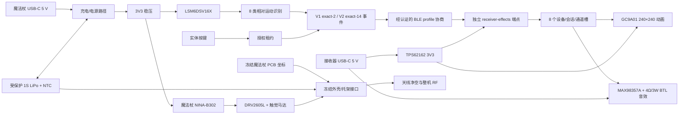

# 魔法杖系统工程交接与插件升级经验

日期：2026-08-23

魔法杖配置：`WAND_PRINTABLE_REV_A0_PLUS_BARE_PCB_REV_A0`

接收器状态：`RECEIVER_EFFECTS_DIRECT_ENDPOINT_PRE_CAM_RELEASE`

机器可读状态：`CURRENT_SYSTEM_STATUS.json`（该文件需在接收器最终 CAM 通过后同步刷新）

## 1. 当前结论

这次已经不再是“画一张图”，而是形成了相互绑定的电子、结构、固件、协议和制造原型链。必须按产物成熟度解释当前状态，不能把主机测试、原生 DRC 或已生成 ZIP 等同于整机可用或生产放行。

- 魔法杖 15 × 80 mm、4 层 PCB 已冻结，原生 KiCad ERC 0、DRC 0、未连接 0、封装错误 0，23/23 封装权威测试通过；
- 魔法杖 PCB、可打印两半式外壳及其装卸接口均已冻结，后续接收器、显示和音效工作不得反向修改魔法杖；
- 魔法杖嘉立创裸板 ZIP 已生成并校验，可按预设参数建立 **5 片原型裸板**订单；BOM/CPL 随包提供，但供应链和贴装闭环尚未完成，所以不能冒充 PCBA 一键贴装包；
- 可打印外壳包含上下壳、PCB/电池托架、尾盖、8 mm 杖杆接头和按键柱，提供 STL、STEP、装配 STEP、预览和校验报告；6/6 STL 已通过单体、水密、有效体积、非流形边、破面、退化面和重复面门禁；
- 外壳已经预留受保护 1S LiPo 最大 11 × 6 × 42 mm、电池拉带/线束空间，以及 10 × 3.4 mm 硬币式触觉马达固定杯；电池、触觉马达、PCB、载架与壳体的受检碰撞体积均为 0；
- 便携式固件核心能区分轻敲、顺/逆旋、左/右挥、前刺、顺/逆时针画圈共 8 类动作，并具有实体按键门控、回稳拒识、跨轴含混拒识和 250 ms 防连击；
- `receiver-effects` 是独立、直接与魔法杖配对的 BLE 媒体端点，带有自己的 NINA-B302，不是中继器；它维护 8 个相互隔离的设备/会话/通道槽，并把 8 类动作映射为 8 种屏幕动画与音效；
- 配对、已连接、断开、低电、未知命令和故障仅是状态提示，不占用魔咒通道；显示/音效也绝不隐式授权继电器、点火器、电机或其他危险输出，危险输出权限默认关闭；
- 接收器主机证据达到干净构建 25/25、CTest 8/8、cppcheck 9/9、源文件哈希 37/37；证据文件 SHA-256 为 `73C595844F2E9526CE5D2C01A84986BA83089CBED20AF60F50E7AE5F5C4D1D70`；
- 上述主机证据验证协议、会话隔离、状态机、媒体调度和主机侧边界，不证明真实 BLE/密码学、NINA-B302 目标构建、显示/I²S、电源/EMI、RF 或 HIL；这些目标/实物门仍保持开放；
- 接收器当前 PCB 设计边界为 50.3 × 42.3 mm、4 层。此前导出的 CAM 因高电流网络被自动布线器降为 0.25 mm，以及局部回流路径和 CPL 坐标仍需复核，已明确标记为 **REJECTED**；旧 ZIP 不得上传或下单；
- 接收器正在按主干宽度、受限短颈缩、有效平面入口和局部回流重新整改。最终 ERC/DRC/未连接/原理图一致性、线宽审计、CPL 多点反算和新 CAM 哈希均为**待替换最终结果**，本文件不得提前写成“接收器已通过制造审查”。

魔法杖原型裸板和原型打印已经得到所有者授权；接收器只授权在最终 CAM 通过后制作原型裸板。量产、PCBA、目标固件发布和整机性能声明仍未放行。

## 2. 三条必须同时闭环的系统流

任何一条流单独“看起来完成”都不能证明整机完成：

- 电源流决定电池尺寸、热、USB 开口、NTC、线束、欠压行为，以及接收器功放峰值电流、压降和复位裕量；
- 信息/安全流决定采样、识别、物理授权、经认证的 profile 协商、身份/会话冗余绑定、重放保护和接收器安全输出；
- 几何/RF/制造流决定 PCB 坐标、开口、按键、安装孔、电池/马达金属包络、天线净空、制造原点、层叠和装配坐标。

## 3. 关键接口控制

| 接口 | 提供方 → 使用方 | 冻结契约 | 当前证据 |
|---|---|---|---|
| PCB→外壳 | 电子 → 机械 | `case_x = pcb_x - 7.5`；`case_z = pcb_y + 9.0` | `printable-wand/design-input.json` |
| 安装孔 | PCB H1/H2 → 托架 | `(0,29.25)`、`(0,86.0)`；尼龙 M2 | STEP/STL 与碰撞报告 |
| USB-C | J1 → 壳体 | `+X` 面，中心 `z=47.0 mm` | 上下壳圆角开口 |
| 实体按键 | SW1 → 壳体/固件 | `+Y` 面，中心 `z=73.5 mm`；松开即清空手势窗口 | 按键柱 + 流式测试 |
| 电池 | 电芯/线束 → 托架/J2 | 最大 11×6×42 mm；中心 `(0,-6.9,62)`，`z=41..83 mm`；BAT+/NTC/GND；8 mm 弯线余量 | 电源仓校验报告 |
| 触觉 | J3/DRV2605L → 上壳 | 最大直径 10×厚 3.4 mm；距 RF 区 5 mm | 固定杯 + 零碰撞报告 |
| 天线 | NINA → PCB/外壳 | 壳体 `z=5..30 mm` 内无电池、金属紧固件、致密填料 | PCB 约束 + 外壳包络 |
| 杖杆 | 结构 → 整机 | 8 mm GFRP，切长 195 mm，插到底后目标总长 315 mm | 打印装配指南 |
| IMU 坐标 | PCB/装配 → 固件 | 杖 `+X` 指尖、`+Y` 向左、`+Z` 向按键；原始轴必须校准映射 | `TARGET_GESTURE_INTEGRATION.md` |
| Legacy V1 事件 | 识别 → 无线/接收器 | `[gesture_id, confidence]`，**精确 2 字节**，只允许 `channel 0`；这是能力较弱的兼容路径 | 长度/profile 拒绝向量通过；目标 BLE/HIL 未验证 |
| Multichannel V2 事件 | 识别 → 无线/接收器 | **精确 14 字节、大端序**：schema/channel/gesture/confidence/battery/flags/device_id/session_id；显式认证协商；必须 `ARM_ACTIVE`；认证身份与载荷身份冗余绑定 | 主机协议、会话和运行时向量通过；目标密码学/HIL 未验证 |
| 逻辑通道 | 接收器会话层 → 媒体层 | 8 个相互隔离的 device/session/channel 槽；一槽失效不得打断其他槽；状态提示不占魔咒通道 | CTest 8/8；跨真实 BLE 并发 HIL 待验证 |
| 显示附件 | J2 → Waveshare SKU 19192 | 1.28 英寸 GC9A01、240×240；8 针顺序 VCC/GND/DIN/CLK/CS/DC/RST/BL | 原理图/封装/引脚契约已建立；实物点亮待验证 |
| 音频附件 | J3/MAX98357A → C50387216 | XHXDZ 30MM-4Ω3W-TFHM，JST-PH 外接；`SPK+`/`SPK−` 为 BTL，均不得接地 | 原理图/封装/引脚契约已建立；功率、温升、音质待验证 |
| 接收器电源 | USB-C → TPS62162/MAX98357A | 合格 5 V/2 A 外部电源；3V3 逻辑轨，功放使用 5V；不依赖 PD/QC | 电源拓扑已建立；线宽/回流整改和实物电源测试待完成 |

V2 的 14 字节字段宽度为 1+1+1+1+1+1+4+4；`battery = 0xff` 表示未知。接收器默认 profile 为 `UNSUPPORTED`，必须在认证握手中显式选择 V1 或 V2，不能只凭收到 2 字节或 14 字节自行切换。V2 缺少 `ARM_ACTIVE` 时只关闭并静默清除对应槽，不得产生动画、音效或影响其他已连接槽。Legacy V1 没有 ARM 字段，必须作为风险更高、能力更弱的兼容路径单独标识。

8 个逻辑魔咒映射被冻结为：

| 通道动作 | 媒体效果 |
|---|---|
| `TAP` | `EXPLOSION` 爆炸 |
| `TWIST_CW` | `FIRE` 火 |
| `TWIST_CCW` | `ICE` 冰 |
| `SWISH_LEFT` | `LIGHTNING` 闪电 |
| `SWISH_RIGHT` | `SHIELD` 护盾 |
| `THRUST` | `ARCANE` 奥术 |
| `CIRCLE_CW` | `HEAL` 治疗 |
| `CIRCLE_CCW` | `PORTAL` 传送门 |

接口文件必须比某一学科的图纸更有权威性。上游 PCB 坐标或电池包络变化后，机械包必须因哈希/约束不匹配而失败，不能静默沿用旧 STEP；协议 profile、载荷长度或身份绑定变化后，接收端也必须拒绝未同步版本，而不是猜测兼容。

## 4. 原型制造与装配交接

### 魔法杖嘉立创裸板

- 上传：`electronics/manufacturing/jlcpcb-wand-rev-a0/JLCPCB_WAND_REV_A0_GERBER_DRILL.zip`；
- 数量 5，4 层，板厚 1.6 mm，外层 1 oz，黑油白字，沉金，过孔盖油，单板；
- 不勾选阻抗、金手指、半孔、包边和拼板；去除订单号；
- 本次只下裸板。BOM/CPL 没有完整 LCSC/C-number 和替代料批准，不能勾选 SMT 贴装后假装“直接可用”。

### 接收器效果板

- 主要 IC 为 U1 NINA-B302-00B-00（LCSC C6335962）、U2 TPS62162DSGR（C40256）、U3 USBLC6-2SC6（C7519）和 U4 MAX98357AETE+T（C910544）；
- 外接 Waveshare 1.28inch LCD Module（GC9A01、SKU 19192、240×240）和 XHXDZ 30MM-4Ω3W-TFHM 喇叭（C50387216）；屏与喇叭都是线外附件，不得列入板载 PCBA；
- 目标订单为嘉立创 **5 片原型裸板**：4 层、50.3 × 42.3 mm、1.6 mm、外层 1 oz、最小成品孔按 0.30 mm/焊盘 0.60 mm 约束，默认绿油；只有实时报价仍满足免费条件时才选择黑油；
- NINA/QFN 设计优先沉金，但免费资格和工艺价格必须以创建订单时的实时 CAM/报价为准，不能靠文档预判；
- 本轮只授权裸板，不授权 PCBA。BOM/CPL 用于审查和后续装配准备，不改变裸板交付边界；
- 旧接收器 Gerber/CAM 已拒绝。只有在 `USB_VBUS_RAW`/`USB_VBUS_5V` 主干 0.8 mm、`SPK_PLUS`/`SPK_MINUS` 主干 0.6 mm、`3V3`/`BUCK_SW` 主干 0.5 mm，并且细间距焊盘只保留有边界的短颈缩后，重新通过 ERC、DRC、未连接、原理图一致性、线宽比例、平面入口、回流路径和 CPL 多点反算，才能生成新的可上传 ZIP；
- CPL 不能只看“文件可解析”。必须固定制造原点、单位、正反面镜像规则和旋转约定，并用至少三个不共线器件从 KiCad 坐标正算到 CPL、再从工厂预览反算回 PCB；若任一点不一致，CAM 包仍是候选件而不是交付件；
- 最终接收器 CAM 文件名、ZIP SHA-256、板源 SHA-256、ERC/DRC/一致性结果、线宽审计摘要和 CPL 反算结果：**待功率宽度/局部回流/CPL 整改完成后替换**。

### 外壳打印

- 使用 `mechanical/printable-wand/outputs/MW_PRINTABLE_WAND_REV_A0.zip`；
- 上下壳分型面朝打印平台，0.20 mm 层高、4 道壁、35% 陀螺填充；PETG/ASA/ABS/PA12；
- 首件先打印并干装，不上胶；测量实际收缩、USB 插拔、按键回弹、M2 扭矩、电池拉带和触觉马达夹持；
- 杖杆优先 8 mm 实心 GFRP，195 mm；未重新做 RF/结构审查前不要改成导电碳纤维或金属杆。

### 首次上电

魔法杖先用电池模拟器和限流 USB，后接真实锂电。必须核对 J2 极性和 NTC；测试充电暂停、温升、3V3、I²C、IMU 轴、触觉马达、实体按键、掉电/复位和无线丢链。

接收器先用限流 5V 电源，不先接喇叭；确认 5V/3V3、电流和复位后再接屏，最后接 4 Ω BTL 喇叭。示波检查功放启动/静音、峰值电流和电源跌落。未完成这些测试前，“零 ERC/DRC”只证明设计文件的一部分一致性，不证明实物安全或功能。

## 5. 尚未完成的工作（按风险排序）

1. 完成接收器高电流线宽、短颈缩、平面入口和局部回流整改；重新执行 ERC/DRC/未连接/原理图一致性及独立线宽审计，不得复用旧 CAM；
2. 固定接收器 CAM/CPL 原点和旋转规则，用至少三个不共线器件反算工厂坐标，生成并独立审查新的 Gerber/钻孔/BOM/CPL/manifest；
3. 安装固定版本的 nRF Connect SDK/Zephyr/ARM 工具链，建立 NINA-B302 板级定义并生成、刷写、哈希化魔法杖和接收器目标镜像；
4. 在真实屏、功放、喇叭和 USB 5V/2A 电源上测试启动、背光、动画、I²S、BTL 音频、峰值电流、压降、温升、复位和 EMI；
5. 在真实 BLE 上执行 V1/V2 显式协商、身份/会话绑定、ARM 租约、8 槽并发、断链恢复、重放和故障注入 HIL；
6. 选定可采购的受保护 1S LiPo + 10k NTC + JST-SH 三线成品，核对供应商图纸、极性和真实最大尺寸；
7. 给所有 BOM 行完成供应商/LCSC 编码、生命周期、替代料和贴装方向复核，之后才能生成 PCBA 订单；
8. 先用真实切片器导入 6 个 STL，记录零修复/零悬浮岛和成功层预览，再打印首壳并装入真实 PCB、电池和触觉马达，记录尺寸修正；
9. 装配魔法杖首板，执行 USB/充电/热/NTC/欠压/I²C/触觉/RF 上电测试；
10. 采集至少 12 名代表用户的数据，按用户划分训练/测试，报告混淆矩阵、误触发/小时、拒识率和延迟；
11. 完成独立电子、机械、无线和安全审查后再考虑生产放行。

## 6. 这次系统工程的核心经验

### 6.1 先冻结系统边界，再画图

“魔法杖”不是一个 PCB 或一个外壳，而是能源、传感、算法、无线、执行、人体和制造边界的组合。先定义用途、禁用场景、能量边界和可验证指标，再允许各学科生成图纸。否则每张图都可能局部正确、系统错误。

### 6.2 接口是跨学科的单一真相源

USB 中心、安装孔、电池包络、天线区、按键轴、坐标变换、协议 profile、载荷长度和身份绑定应进入机器可读 ICD。图纸、STEP、固件常量和制造包都从 ICD 派生，并绑定上游哈希。手工在多份文件里重复数字，必然产生坐标、版本和声明漂移。

### 6.3 “生成”“工具验证”“实物验证”“生产放行”必须分层

- 生成：文件存在、格式可打开；
- 工具验证：ERC/DRC、编译、碰撞、清单哈希通过；
- 独立审查：另一条工具链或审查人验证关键假设和工艺边界；
- 实物验证：首件尺寸、温升、波形、RF、HIL 和用户数据通过；
- 放行：配置、证据、人员审批和供应链均冻结。

插件不能把第一层或第二层的绿色状态包装成第四层或第五层。

### 6.4 变更必须反向传播

电池变厚会影响壳体、人体握持、天线、重心、充电热和 BOM；PCB 按键移动会影响开孔、按键柱、手势坐标和人机反馈；接收器功放或喇叭变化会影响 5V 峰值、电源主干、回流、EMI 和媒体调度。系统生成器需要依赖图和影响分析，而不是只重画被点名的那张图。

### 6.5 拒识和故障路径也是功能

手势识别不能只测试 8 个正样本；静止、含混跨轴、松开按键、防连击、丢链、缺 ARM、身份错配和低置信度才决定系统是否可用。每个功能都要同时定义成功路径、拒绝路径、超时路径、槽级隔离和恢复路径。

### 6.6 工厂适配器必须消费已验证设计

嘉立创导出不能是人工复制设置。适配器应重新跑 ERC/DRC、校验板哈希、生成 Gerber/钻孔/BOM/CPL、写入订单参数并形成 manifest。若 BOM 供应链信息不完整，就只允许裸板模式，不能自动升级成 PCBA。

### 6.7 原生 DRC 是必要条件，不是充分条件

这次接收器曾达到原生 DRC 0、未连接 0，但自动布线器仍把 5V、3V3 和 BTL 扬声器网络统一降为 0.25 mm。几何间距正确不等于载流、压降、温升或瞬态正确。插件必须根据负载、电源路径和铜厚生成**按网络的电流/线宽契约**，报告每条网络的总长、窄线段数量/长度/比例，并只允许在细间距焊盘附近出现有明确最大长度的短颈缩。

### 6.8 回流路径和差分拓扑必须作为图来验证

单看某根线没有短路不够。电源入口、去耦、开关节点、功放大电流环和换层过孔都需要连续、短而可解释的回流路径；USB D+/D− 等差分网络还要检查成对拓扑、参考平面连续性、换层对称性、支路和长度关系，不能只检查两根线各自的宽度与间距。系统设计器应把“前向电流路径 + 回流路径 + 参考平面”作为一个可审查对象。

### 6.9 CPL 正确性需要原点契约和多点反算

CPL 能被表格工具打开，不代表贴装坐标正确。制造原点、单位、板面镜像、角度正方向和封装零度必须版本化；至少选三个不共线、方向不同的器件，将 KiCad 坐标正算到 CPL，再从工厂预览反算回 PCB。单点对齐只能发现平移，无法可靠发现镜像、旋转或缩放错误。

### 6.10 产物成熟度与声明边界必须机器可读

同一个 ZIP 应明确处于 `generated`、`tool-verified`、`independently-reviewed`、`prototype-released`、`physically-validated` 或 `production-released` 中的哪一级。任何较低等级证据都不能自动继承较高等级措辞。被拒绝的 CAM 还必须带有不可误用的状态、原因和替代目标，防止“文件最新”被误解为“制造已放行”。

### 6.11 验证覆盖本身也必须被审计

“验证器通过”只有在它确实覆盖需求时才有意义。应维护“需求 × 证据 × 失败模式”的覆盖矩阵，逐项说明使用的是原生工具、独立算法、数据手册、实物试验还是人工审查。本项目中，单看 zone 外框会误判铜皮覆盖，单看线段总长度会把并联短颈错误相加，单看 DRC 连通又会漏掉同网但不归主根的铜岛；正确做法是基于**实际填充铜、焊盘根、过孔和线段的连通图**计算，并用合成反例测试验证器自身。插件必须把“验证器版本、覆盖范围、已知盲区、反例测试和原始证据”与产品产物一并交付。

### 6.12 静态零碰撞不等于可安装、可拆卸和可维护

两个实体在最终装配位置不相交，只能证明一个静态状态。系统还必须检查 PCB、电池、线束、按键柱、紧固件和杖杆的安装路径、拆卸路径、工具扫掠、手指空间、连接器插拔方向、线缆弯曲半径及维修顺序。每个可维护部件都应具有“进入姿态 → 过渡扫掠 → 就位姿态 → 退出姿态”的状态序列；若某一步只能通过过度弯折线缆、先破坏另一个部件或使用不可达工具完成，就不能宣称装配闭合。

### 6.13 制造姿态也是跨域接口

STL/STEP 的几何相同，不代表制造结果相同。3D 打印朝向会改变层间强度、支撑痕迹、孔径、表面观感和装配基准；PCB 的 CAM 原点、板面、镜像和旋转会改变工厂解释；包装与运输姿态会改变受力和保护需求。因此打印朝向、支撑禁区、关键外观面、工装基准、CAM 原点和包装姿态都应作为版本化接口，而不是交付后由操作员临时决定。

### 6.14 冻结的是已证明的契约，不是已发现的缺陷

外观轮廓、用户可见接口和已验证坐标可以冻结，但内部走线、回流、紧固、材料或安全逻辑若出现证据充分的缺陷，必须允许受控修正。插件需要区分“外部接口冻结”“内部实现可变”和“安全强制变更”三类，并自动传播影响、重新运行相关门禁。冻结不能成为保留缺陷的理由，修复也不能无声改变用户已经批准的外观或接口。

### 6.15 时间、持久化和并发也是系统接口

两个 MCU 的 uptime 不能直接比较；认证握手必须建立时钟映射，帧的新鲜度才能在接收器时钟域判断。心跳、ARM 租约、手势和 DISARM 又必须共享同一加密序列，而逐帧写 flash 会在多通道下迅速耗尽寿命。因此安全协议、调度周期、BLE 吞吐、掉电恢复和存储耐久必须共同设计：每次会话只原子持久化新的 epoch，会话内用 RAM 高水位拒绝重放，重启后禁止恢复旧会话；最坏 8 通道并发仍需真实链路 HIL 证明时限和队列裕量。系统设计器应自动把“频率 × 通道数 × 生命周期”换算成吞吐和写入次数，而不是只验证单帧格式。

## 7. 将 AICAD 插件升级为系统设计器

建议把插件架构拆成九层：

1. **需求编译器**：把自然语言转成需求 ID、验收指标、禁止用途和验证方法；
2. **系统架构器**：建立能量流、信号流、力/热/物流和安全边界；
3. **接口契约引擎**：管理坐标、包络、连接器、单位、公差、协议和版本；
4. **学科生成器**：机械、电子、固件、包装、土木等各自生成原生可编辑文件；
5. **跨域求解器**：检查空间、热、功率、RF、线束、安装、维护和人机冲突，并把载流主干/短颈缩、回流路径、参考平面和差分拓扑纳入规则；
6. **证据账本**：每个结论绑定源文件哈希、工具版本、测试命令、结果和声明边界；
7. **成熟度与声明引擎**：区分生成、工具验证、独立审查、原型放行、实物验证和生产放行，自动阻止越级声明；
8. **制造适配器**：针对嘉立创、3D 打印、机加工、包装打样或施工交付生成受控包；PCB 适配器必须管理原点、镜像、旋转、CPL 多点反算和工厂预览证据；
9. **统一审查器**：按系统/接口/风险视角查看 2D、3D、PCB、协议、BOM、回流/载流证据和开放门，而不是按文件夹浏览。

这个框架也适用于更广的工科图纸：

- 机械：力、运动、公差、材料、工艺和维护空间；
- 电子：电源、信号完整性、热、EMC、器件权威和制造测试；
- 包装：产品包络、缓冲、跌落、堆码、物流和标签法规；
- 土木：场地、荷载、结构、机电、排水、消防、施工阶段和规范证据。

不同学科共用的不是画线算法，而是“需求 → 接口 → 原生模型 → 跨域验证 → 独立证据 → 制造/施工放行”的闭环。

## 8. 交接时的完成定义

后续负责人只有在以下证据全部存在时，才能把整机目标标为完成：

- 魔法杖和接收器的嘉立创订单均已创建，且各自 CAM 预览与已放行 ZIP 哈希一致；接收器旧 REJECTED CAM 未被误用；
- 真实切片器导入通过，打印首件和装配测量通过并回写最终补偿；
- 真实电池、触觉马达和魔法杖 PCB 已装配，无干涉、夹线和异常温升；
- 魔法杖和接收器 NINA-B302 目标镜像均可复现构建、刷写、升级和回滚；
- 8 类手势在代表用户数据上达到批准指标；
- 魔法杖与接收器完成真实 BLE 的 V1/V2 profile、8 槽并发、ARM、身份绑定、丢链、复位、重放和输出安全 HIL；
- 接收器真实屏幕、I²S 功放、BTL 喇叭、电源、温升、EMI 和 RF 测试通过；
- 所有开放门关闭且独立工程审查签署。

在此之前，正确状态是“魔法杖可下原型裸板、可打印原型壳；接收器协议/运行时主机验证通过、硬件处于最终 CAM 整改前候选状态”，不是“接收器可下单”、不是“整机已可直接量产使用”。
