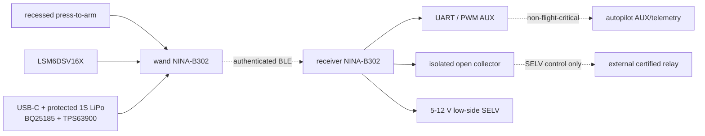

# 系统方框与接口控制

权威坐标：机械 A 基准为后端盖外平面 Z=0，B 为整机轴线，单位 mm。SVG 为审查视图，不是原理图、PCB 或装配 BREP。

| 接口 | 方向 | 安全状态/边界 | 当前状态 |
|---|---|---|---|
| IF-MECH-PCB-001 | mechanical → wand PCB/carrier | No forced assembly; quote-only until native fit/interference proof. | blocked |
| IF-ARM-001 | press-to-arm switch → wand MCU ARM_N | Stuck-low is a fault; release requests disarm; no command enable without continuous hold. | blocked_hil_pending |
| IF-RF-001 | NINA-B302 internal PIFA → enclosure/host PCB | No RF pass claim; final vendor-rule overlay and representative hand/enclosure test required. | blocked_rf_test_pending |
| IF-PWR-WAND-001 | USB-C / protected 1S LiPo → wand power tree | Charge prohibited until exact cell/protection/NTC limits and thermal behavior are verified. | blocked_eda_bench_pending |
| IF-BLE-001 | wand NINA-B302 → receiver NINA-B302 | Invalid, stale, duplicate or unauthenticated packets cause no output and do not renew arm lease. | blocked_target_security_test_pending |
| IF-RX-LOGIC-001 | receiver → external controller | Outputs default inactive; no propulsion energy or arming/primary flight control. | blocked_eda_bench_pending |
| IF-RX-ISO-001 | receiver optocoupler → external low-voltage input | Signal isolation only; no mains conductor on PCB or inside enclosure. | blocked_eda_bench_pending |
| IF-RX-LOAD-001 | receiver MOSFET → external SELV load | No mains and no flight propulsion; hardware pulldown holds gate inactive on reset. | blocked_drc_thermal_load_test_pending |
| IF-MAINS-001 | receiver SELV output → external certified relay/contactor | Qualified electrical professional review mandatory; no mains enters AICAD PCB/enclosure. | external_specialist_required |
| IF-DRONE-001 | receiver signal → autopilot AUX/telemetry | Integrator-configured failsafe; ground and restrained-prop test before any flight. | external_specialist_required |

所有接口的完整约束和证据路径见 `system-interface-control.json`。任何表中“blocked/pending/external specialist”都不能被下游测试或视觉审查补偿。
