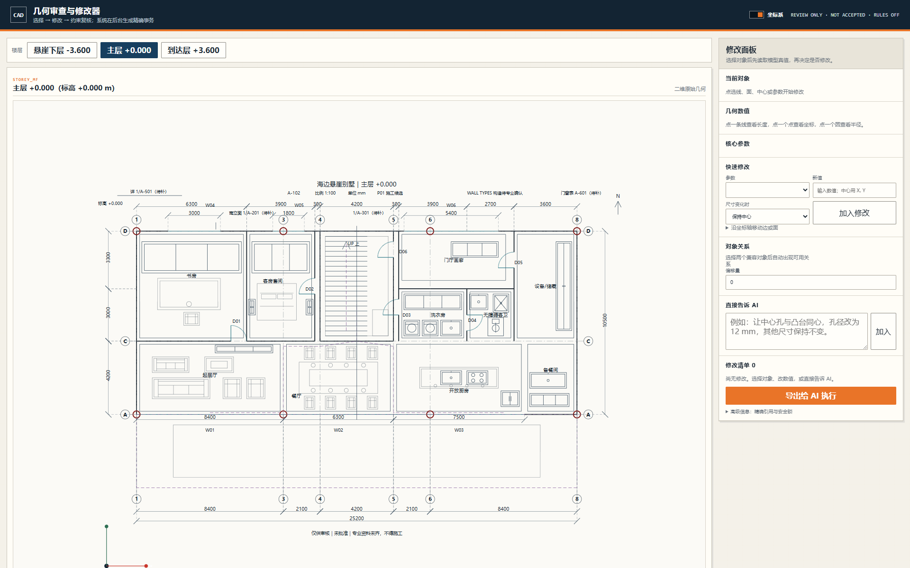
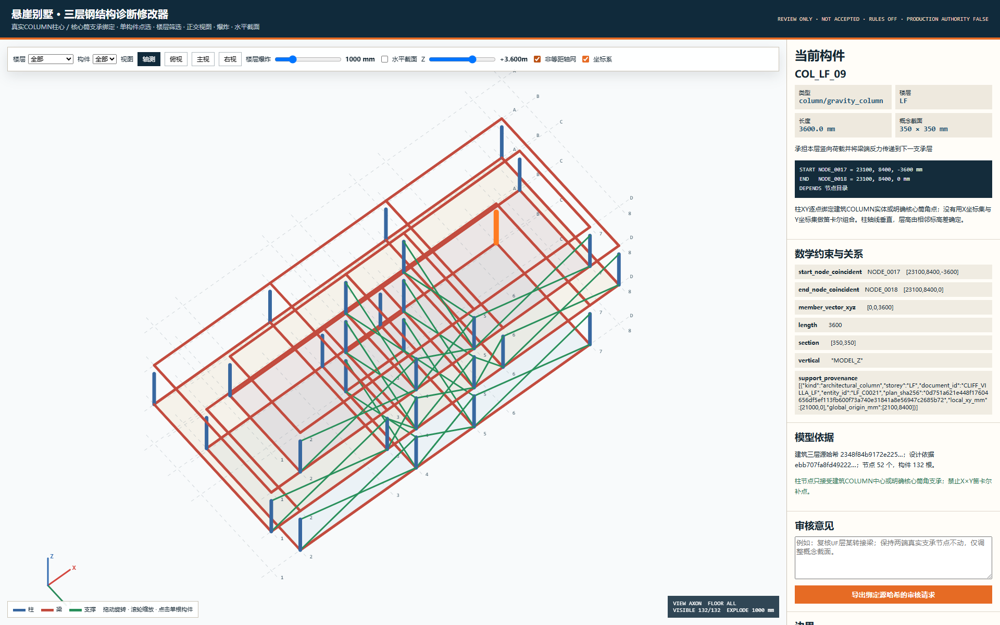
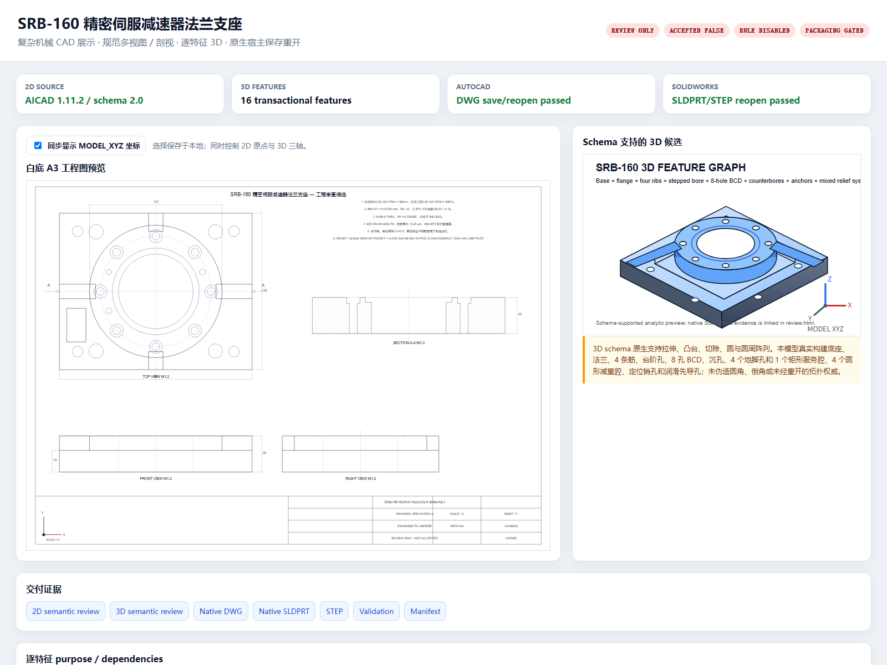
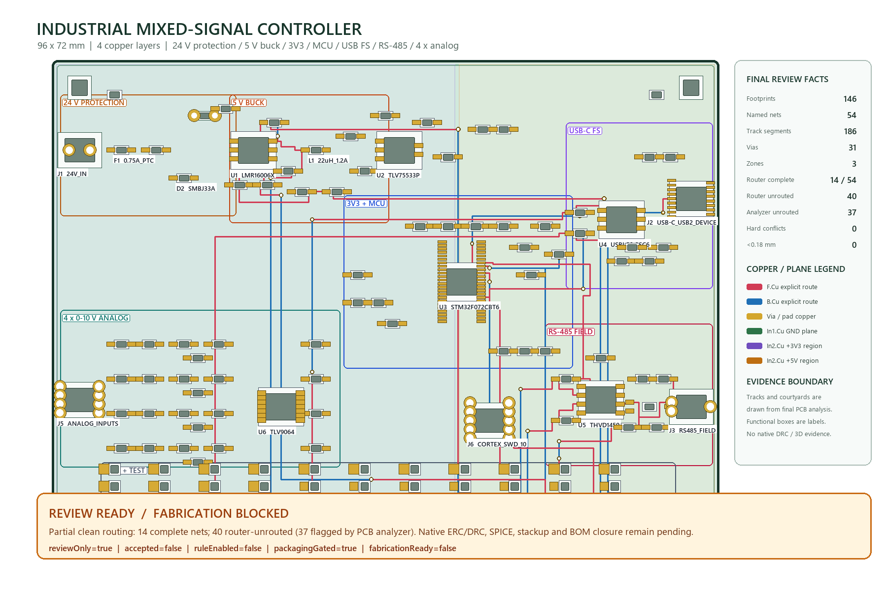

# aicad-agent 跨领域工程候选展示

这里展示由同一套 `aicad-agent` 约束、审查与修改流程生成的跨领域样例。每个样例都提供可直接查看的白底预览、交互审核页、中文与机器验证报告，以及经过公开脱敏和闭包校验的确定性审核候选 ZIP。

> 所有样例均为工程候选与人工审核材料：`reviewOnly=true`、`accepted=false`、`ruleEnabled=false`、`packagingGated=true`。展示通过不等于施工、结构、制造、装配或投板验收。

## 样例

| 领域 | 预览 | 主要证明 | 审核与下载 |
|---|---|---|---|
| 三层建筑平面 | [预览](architecture/preview.png) | 三层独立文档、支承派生非等距轴网、原生尺寸/中文、双视口零碰撞 | [交互审核](architecture/review.html) · [人工验证](architecture/validation.md) · [机器验证](architecture/validation.json) · [源闭包](architecture/source-manifest.json) · [公开候选包](architecture/architecture-sanitized-review-candidate.zip) |
| 三层钢结构 | [预览](steel/preview.png) | 建筑柱心与核心筒点集双向绑定、禁止轴坐标笛卡尔扩增、楼层/视图/剖切选择 | [交互审核](steel/review.html) · [人工验证](steel/validation.md) · [机器验证](steel/validation.json) · [源闭包](steel/source-manifest.json) · [公开候选包](steel/steel-sanitized-review-candidate.zip) |
| 复杂机械零件 | [预览](mechanical/preview.png) | 逐特征三维模型、规范二维多视图/剖视、尺寸与制造语义、真实宿主保存重开 | [交互审核](mechanical/review.html) · [人工验证](mechanical/validation.md) · [机器验证](mechanical/validation.json) · [源闭包](mechanical/source-manifest.json) · [公开候选包](mechanical/mechanical-sanitized-review-candidate.zip) |
| 四层工业控制器 PCB | [预览](pcb/preview.png) | 电源树、MCU/USB/CAN/模拟前端、四层布线与平面、DFM/连通性/标准审计 | [交互审核](pcb/review.html) · [人工验证](pcb/validation.md) · [机器验证](pcb/validation.json) · [源闭包](pcb/source-manifest.json) · [公开候选包](pcb/pcb-sanitized-review-candidate.zip) |

### 三层建筑平面

### 三层钢结构

### 复杂机械零件

### 四层工业控制器 PCB

## 证据口径

- 图片、网页或参考 CAD 只提供外观/拓扑时，不作为尺寸真值；尺寸由需求合同、工程输入或明确假设提供。
- 每个结构或特征都有 ASCII ID、用途、推理、前向依赖和数学约束；首个生产实体从原点开始。
- 生成器先做规范与整体需求门禁，再做逐对象几何、关系、标注、宿主和视觉核验。
- 公开候选包内不包含个人绝对路径、凭据、缓存、临时目录或失败中间态；`showcase-manifest.json` 记录所有公开输出文件的精确哈希闭包。
- PCB 样例若缺少原生 KiCad ERC/DRC 或 SPICE 环境，即使独立解析门禁通过也保持 `fabricationReady=false`。
